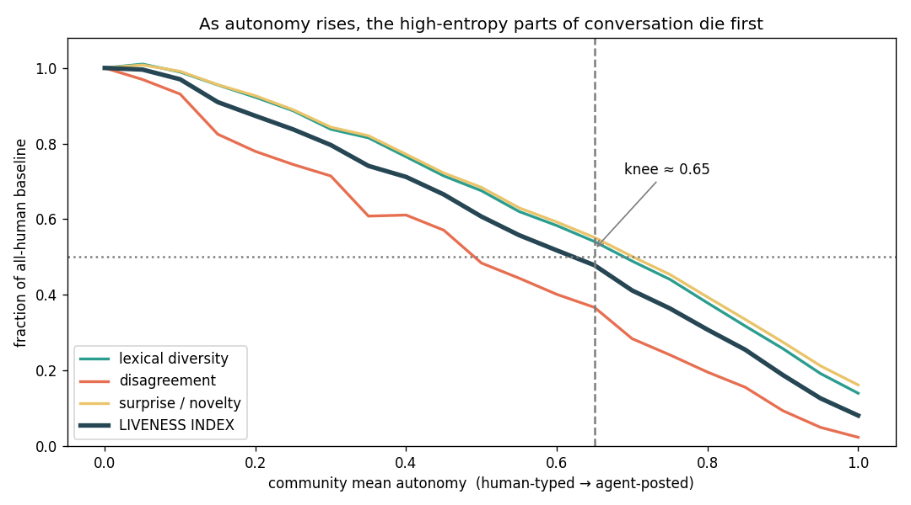
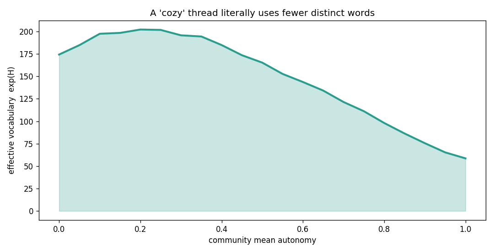
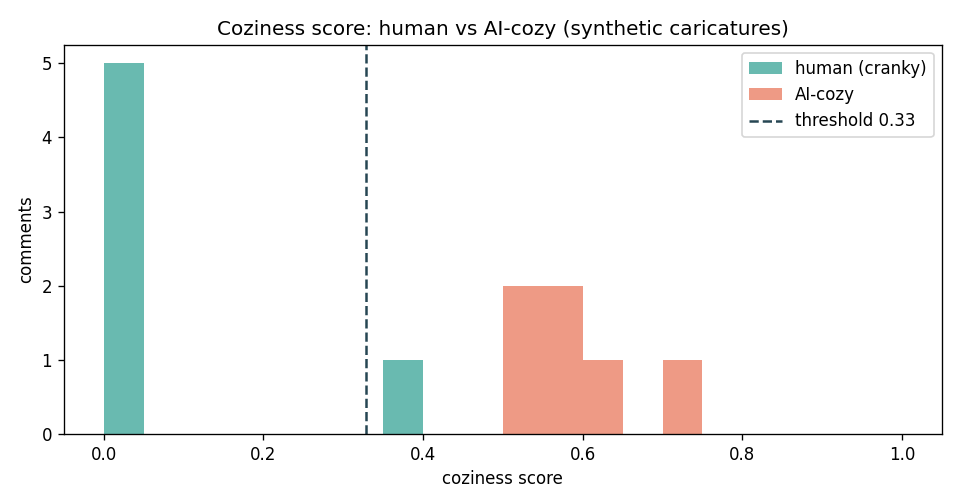

# The Cozy Web Is a Dead Internet With Good Manners

*Or: why your favorite dev blog feels so nice now, and why that might be the symptom rather than the cure.*

---

You've felt it. You ship a post to [DEV](https://dev.to), or you scroll one, and the comments are… lovely. "Great write-up!" "This is so helpful, thanks for sharing!" "Really insightful — looking forward to the next one!" Nobody's mad. Nobody found the bug on line 14. Nobody says "actually, you benchmarked this wrong." It is, by every available measure, a *nice place to be*.

I want to argue something uncomfortable: a meaningful slice of that niceness isn't the community getting kinder. It's the community getting **quieter** — fewer people reading closely and writing back — and an increasingly autonomous layer of AI filling the silence with text that is, by construction, pleasant and frictionless. The blog feels cozy for the same reason a dead body feels calm. The thing that made it loud was the thing that made it alive.

This isn't a doom post. It's a *measurement* post. I built two small tools to make the thesis falsifiable instead of just vibey, and I'll show you exactly where the models hold up and where they're caricatures. Code at the bottom; the argument first.

---

## Two old ideas, colliding

**Dead Internet Theory.** The ur-text is a January 2021 forum post on Agora Road's Macintosh Cafe titled "Dead Internet Theory: Most Of The Internet Is Fake" ([Wikipedia](https://en.wikipedia.org/wiki/Dead_Internet_theory)). Kaitlyn Tiffany brought it to a mainstream audience that year in *The Atlantic* — ["Maybe You Missed It, but the Internet 'Died' Five Years Ago"](https://www.theatlantic.com/technology/archive/2021/08/dead-internet-theory-wrong-but-feels-true/619937/) (2021). In its original, paranoid form it's a conspiracy: the web "died" around 2016 and is now "empty and devoid of people," with bots and state actors gaslighting the rest of us.

Strip out the paranoia and you're left with something a lot of engineers now quietly believe. The post-2022 version doesn't need a government — it just needs ChatGPT. And the numbers stopped being a joke: Imperva's [2025 Bad Bot Report](https://www.imperva.com/blog/2025-imperva-bad-bot-report-how-ai-is-supercharging-the-bot-threat/) put **automated traffic at 51% of the web in 2024** — the first time bots crossed half — and credits LLMs directly for lowering the barrier to building them. Even Sam Altman has [said the quiet part](https://time.com/7316046/sam-altman-dead-internet-theory/): the wave of AI-driven activity makes "dead internet theory" feel real.

**The Cozy Web.** Meanwhile, the other half of this story is a *retreat*. Yancey Strickler's "Dark Forest Theory of the Internet" (2019) and the term **"cozy web"** — coined by Venkatesh Rao, popularized and beautifully diagrammed by Maggie Appleton in ["The Dark Forest and the Cozy Web"](https://maggieappleton.com/cozy-web) — describe people fleeing the troll-and-bot-infested public square into "high-gatekeeping" private spaces: Slacks, group chats, Discords, email, DMs. The public web gets the bots; the humans go where the bots can't follow.

Appleton's follow-up, ["The Expanding Dark Forest and Generative AI"](https://maggieappleton.com/forest-talk) (2023), is the single most on-thesis thing I read while writing this. Her point: generative AI *accelerates* the retreat. The more synthetic the public web gets, the harder humans run for the cozy private rooms.

Here's the move I want to make. **These aren't two theories. They're one feedback loop.** The public web fills with frictionless AI text → real conversation migrates to private rooms → the public spaces that remain (your blog's comment section) get even *thinner* on real humans → which makes them even easier to fill with AI text. Coziness is what the surface looks like while the loop runs.

---

## The comment section was already dying before the robots showed up

This part predates ChatGPT by a decade, and it matters, because it's the *vacuum* the AI rushed into.

Publications started killing comments in the 2010s. *Popular Science* [shut theirs off in 2013](https://thehistoryoftheweb.com/what-happened-to-the-comment-section/), citing research that uncivil comments distorted how readers understood the underlying science. A peer-reviewed analysis of why newsrooms removed commenting — ["Killing the Comments"](https://www.mdpi.com/2673-5172/2/4/34) (Media and Communication, 2021) — found two recurring reasons: moderation cost, and the fact that **the conversation had already migrated to social platforms** where stories got shared. NPR and others basically said: the discussion is happening on Twitter and Reddit now, so why pay to moderate a ghost town?

So by ~2022 the baseline was: comment sections were thin, conversation lived elsewhere, and the muscle of "read a post closely, then write a substantive reply under it" had atrophied for a lot of people.

Then two things happened at once:

1. **Reading got outsourced.** Why read 1,800 words when an assistant will summarize them? The deep-read-then-respond loop is exactly the behavior LLMs are best at replacing.
2. **Writing got outsourced.** Why draft a comment when "make this sound encouraging and professional" is one keystroke away?

Note that *both* the input and the output of human engagement got an AI in the middle. That's the part the dead-internet framing usually misses — it obsesses over fully autonomous bots, but the more common case is a **spectrum of autonomy** running through real people.

---

## The autonomy spectrum is the whole story

Forget "bot vs. human." The honest axis is:

```
human-typed → spell-checked → "polish this" → "write a comment for me" → agent posts on my behalf, I never read the thread
   α=0            α≈0.2            α≈0.5              α≈0.8                        α→1.0
```

Most of the cozy comments under your post aren't from a botnet. They're from real people at α ≈ 0.5–0.8 — folks who genuinely liked your post, opened the box, and let an assistant turn a vague positive feeling into three polished sentences. The text is *technically* human-endorsed and *substantively* machine-shaped.

And yes, the fully autonomous end is real and already documented. University of Zurich researchers covertly ran LLM bots (GPT-4o, Claude, Llama) in r/changemyview, some of them profiling users' age, gender, and politics from post history to personalize arguments. They were [3–6× more persuasive than the human baseline](https://www.engadget.com/ai/researchers-secretly-experimented-on-reddit-users-with-ai-generated-comments-194328026.html), broke the subreddit's no-bots rule, got banned, and drew legal demands from Reddit. That's α = 1.0, undisclosed, at scale, *and it worked better than humans*.

But the interesting damage is in the middle of the spectrum, not the end. So I modeled the middle.

---

## Demo #2: simulating the death of liveness

> Code: [`dead_internet_sim.py`](dead_internet_sim.py). Run it; the charts are seeded and reproducible.

I didn't simulate language — I simulated the *statistics* of language, because the thesis is statistical. Every comment is a bag of tokens drawn from two pools:

- a **human pool**: a big, fat-tailed (Zipfian) vocabulary where the long tail holds the topic-specific terms, the typos, the weird tangents — the high-entropy stuff;
- a **cozy pool**: a tiny, near-uniform vocabulary of phatic praise ("great", "thanks", "insightful").

Each comment has an **assist level α**. With probability α, a given token comes from the cozy pool instead of the human one, and the comment's stance gets pulled from "disagree" toward "agree." Then I sweep the community's *mean* autonomy from 0 → 1 (with every thread a realistic *mix* of fully-human, assisted, and autonomous posters, via a Beta distribution) and watch four "liveness" metrics:

- **lexical diversity** (type/token ratio)
- **disagreement rate** (how often someone pushes back)
- **surprise** (how much genuinely new vocabulary each comment adds)
- a composite **Liveness Index** — the geometric mean of the three, so that zeroing *any* channel kills it. A thread with zero disagreement is dead even if it's lexically busy.

Here's what falls out:



Two things I want you to notice:

1. **It's not linear — there's a knee.** Liveness halves at a community autonomy of about **0.65**. Below that knee, the thread is statistically a *smooth surface*: still polite, still "engaged," contributing almost no new information. You don't need everyone to be a bot. You need the average poster to be ~⅔ on the assist dial, which is… not a high bar in 2026.

2. **Disagreement (the red line) dies first.** It's the steepest curve on the chart. The very first thing an LLM sands off a conversation is friction — the "actually, you're wrong about the LATERAL join" energy. Which is *exactly* the experience of the cozy comment section. It didn't get kinder. It got conflict-free, which we *read* as kind.

And a literal version of "cozy" — the thread uses fewer distinct words:



The effective vocabulary (`exp(entropy)`) of a thread collapses from ~175 words to ~60 as autonomy maxes out. There's an honest wrinkle here I won't hide: at *low* autonomy (0 → 0.2) it ticks *up* slightly. A little AI assistance genuinely adds a new register of vocabulary before saturation sets in and homogenizes everything. The damage isn't from assistance existing — it's from assistance *dominating*.

---

## "Okay, so just detect the AI comments"

This is where people reach for a classifier. I built one too, partly to show you why it's a trap.

> Code: [`coziness_detector.py`](coziness_detector.py).

It's a deliberately *transparent*, heuristic scorer — not a real classifier — for what I call **"AI coziness."** Every feature is something you can read and argue with:

| feature | what it catches | direction |
|---|---|---|
| **burstiness** | LLMs regress to a comfortable mean sentence length; humans write in lumps | low burst → cozy |
| **cliché density** | "Great post!", "Thanks for sharing" — phatic filler | high → cozy |
| **marker words** | the house style: *delve, tapestry, leverage, underscore, pivotal* | high → cozy |
| **politeness/hedging** | uniform deference | high → cozy |
| **em-dash rate** | LLMs love an em dash—like this | high → cozy |
| **sentiment uniformity** | all-positive, zero friction | high → cozy |
| **specificity** | numbers, code tokens, named tools, concrete disagreement | high → **human** |

That last feature — specificity — is the human's escape hatch. The thing generic praise can't fake is *citing the actual thing*: line 14, Postgres 14, `Array.from({length:n})`, "we lost 4 hours to this last sprint."

On hand-written caricatures it separates cleanly:

```
[human]    0.00  | wait, doesn't useMemo here just recompute every render...
[human]    0.00  | nah. tried this exact setup with postgres 14 and the LATERAL join was 3x slower...
[ai_cozy]  0.72  | What a fantastic write-up. You've done an excellent job delving into the intricacies...
[ai_cozy]  0.60  | Great post! This is really insightful and well written. Thanks for sharing...

human   mean coziness: 0.06
ai_cozy mean coziness: 0.60
threshold 0.33 → 11/12 separated
```



**And this is exactly where I have to tell you it doesn't work in the wild.** The caricatures separate because I wrote them to. Real comments live in the messy middle of the autonomy spectrum, and the burstiness/perplexity approach that real detectors use — pioneered by [GPTZero](https://gptzero.me/news/perplexity-and-burstiness-what-is-it/) (2023) and formalized academically by [DetectGPT](https://arxiv.org/abs/2301.11305) (Mitchell et al., 2023, via probability curvature) — is famously unreliable:

- The stylometric "tells" are a moving target. As [The Conversation lays out](https://theconversation.com/too-many-em-dashes-weird-words-like-delves-spotting-text-written-by-chatgpt-is-still-more-art-than-science-259629), ChatGPT and Copilot lean on em-dashes, Claude barely uses them, and some models use none — and expert humans spot AI abstracts only marginally above chance.
- Detectors are *biased*. Liang et al., ["GPT detectors are biased against non-native English writers"](https://arxiv.org/pdf/2304.02819) (*Patterns*, 2023), found GPT detectors flagged **~61% of non-native TOEFL essays** as AI while rarely misflagging native writers. A "coziness" detector is, partly, a *fluency* detector — and punishing fluency punishes ESL developers, who are a huge share of the dev community.

So detection can't save the cozy web. Which leaves platforms doing the only thing that scales: **using AI to police AI.** DEV's own founder published exactly that — ["Fighting Spam at Scale: How We Use Gemini to Protect the DEV Community"](https://dev.to/devteam/fighting-spam-at-scale-how-we-use-gemini-to-protect-the-dev-community-277j) (2025) — a pipeline that calls Gemini to triage content for quality, authenticity, and spam *before a human moderator ever sees it*. I don't say that as a gotcha; it's a sane engineering response to an impossible volume problem. But sit with the shape of it: on the cozy dev platform, an AI now reads most of the content so that humans don't have to, and an AI writes a lot of it so that humans don't have to. The humans are increasingly the *exception case* on both ends.

---

## So is the internet actually dead?

No — and I want to be honest about the counter-evidence, because the doomer version of this essay is wrong.

- AI content on the public web is large but not yet total. Originality.AI's [ongoing tracker](https://originality.ai/ai-content-in-google-search-results) put AI text in Google's top-20 results at **~17–19%** through 2025; Graphite estimated [AI articles passed human articles in raw publication volume around Nov 2024](https://graphite.io/five-percent/more-articles-are-now-created-by-ai-than-humans). (Both numbers come from single-detector studies with real false-positive rates — treat them as directional, not gospel; this is the same unreliability problem from the last section, now pointed at the whole web.)
- The comment section is even *reviving*. Techdirt reports a wave of sites [realizing that killing comments was a mistake](https://www.techdirt.com/2026/02/03/whoops-websites-realize-that-killing-their-comment-sections-was-a-mistake/) and restoring them — leaning on automated moderation to keep them sane. AI giveth the moderation that makes human comments viable again.
- And DEV's reputation for being a genuinely [supportive, no-ego space](https://dev.to/code-of-conduct) is *real* — it's a culture choice, codified in the Code of Conduct, not just an artifact of bots. (Worth flagging: that "cozy" reputation is widely held but rests on community/first-party accounts, not an external study. I'm describing a vibe, not a measurement.)

So the accurate claim isn't "the internet is dead." It's narrower and weirder:

> **The texture of public conversation is converging toward the cozy mean, because the high-entropy human parts — disagreement, specificity, surprise — are precisely the parts that get outsourced first, whether to a bot at α=1.0 or to your own assistant at α=0.6.**

Coziness isn't the opposite of a dead internet. It's its bedside manner.

---

## What I'd actually do about it

Not "ban AI." That's both unenforceable (see: detectors are biased and gameable) and wrong (assistance at α=0.2 genuinely helps ESL writers and tired engineers). The lever isn't autonomy *level*, it's whether autonomy *crowds out the high-entropy channels*. Concretely:

- **Reward specificity, not positivity.** If your platform's ranking signal is "engagement" and engagement is "nice comments," you are directly selecting for the cozy mean. Rank for "cited the actual thing" — code, numbers, a counter-example.
- **Protect disagreement as a feature, not a moderation failure.** The simulation's clearest result is that friction dies *first*. A comment culture optimized purely for niceness is optimizing for deadness with extra steps.
- **Disclose the dial, don't ban the tool.** "AI-assisted" is not a binary, so don't moderate it like one. The useful question is never "was a model involved" — it's "did a human read the thing and stake their specificity on a real reply."

---

## Limitations (read this before you @ me)

- **The simulation is a toy.** Two token pools and a stance variable are a cartoon of language. The *shape* of the collapse (knee, disagreement-dies-first) is a property of the model's assumptions as much as of reality. It's an argument made precise, not evidence.
- **The detector is a strawman by design** — I built it partly to demonstrate its own failure mode (fluency ≠ AI; see Liang et al.). Don't deploy it. Don't deploy *anything* like it as a gate on real people.
- **Several juicy stats didn't survive fact-checking** and aren't in here (e.g. a viral "74% of new web pages contain AI" figure I couldn't trace to a primary source). The numbers above are the ones with traceable methodology, caveats and all.
- **Causation is underdetermined.** Cozy comment sections may also reflect better moderation, kinder norms, or survivorship (the cranks left for Reddit). AI-mediation is *a* driver, not provably *the* driver.

---

## The one-line version

The internet didn't die. It got an assistant, learned some manners, and stopped saying anything surprising. The cozy web is what a conversation looks like when everyone's outsourced the parts that used to make it a conversation.

If this post gets a comment that just says *"Great write-up, really insightful — thanks for sharing!"*… well. You know what to check.

---

### Run it yourself

```bash
pip install -r requirements.txt
python3 dead_internet_sim.py     # liveness collapse + figures
python3 coziness_detector.py     # the heuristic scorer + histogram
```

*Sources for every factual claim are linked inline. The two strongest on-thesis reads, if you only click two: Maggie Appleton's [Expanding Dark Forest](https://maggieappleton.com/forest-talk) and Liang et al. on [why detectors are biased](https://arxiv.org/pdf/2304.02819).*
